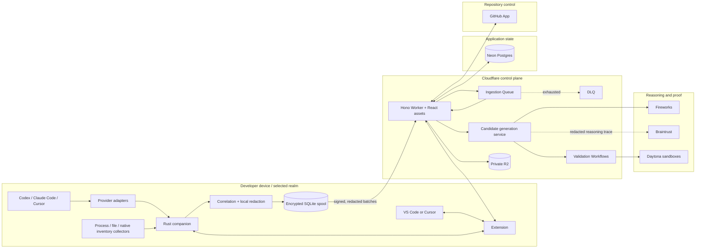
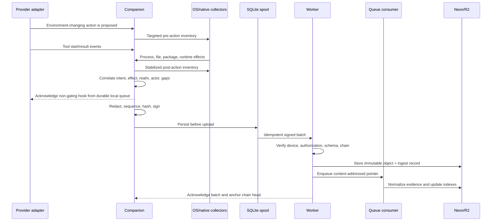
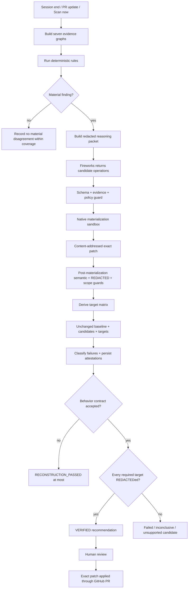
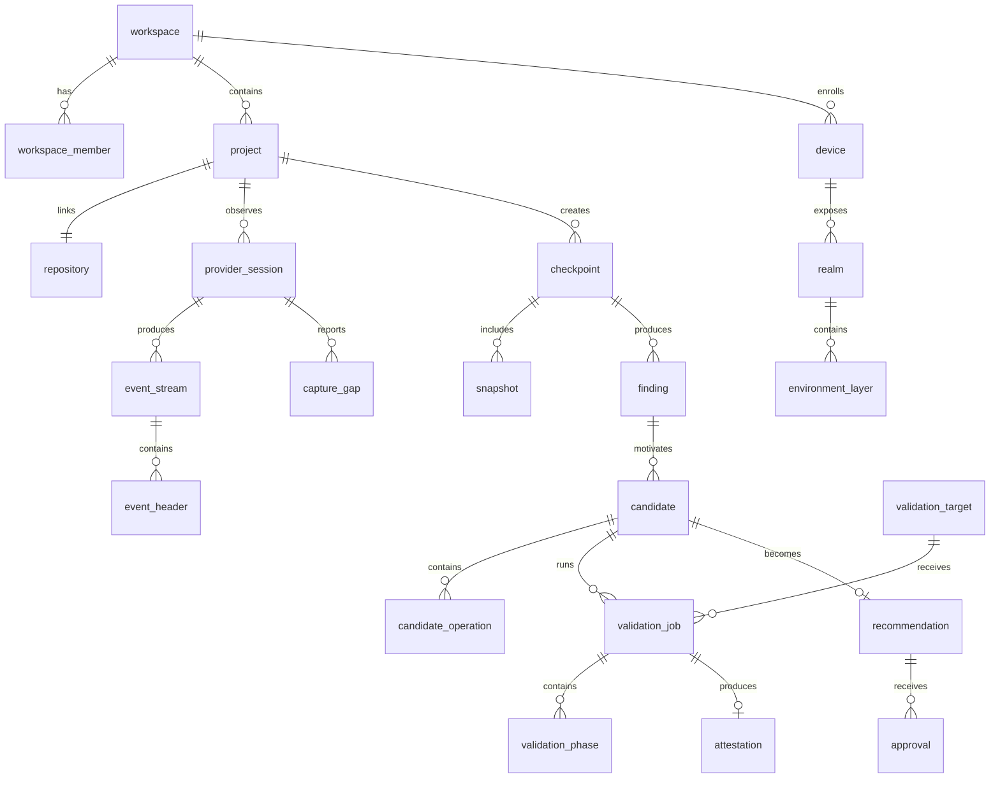

# Design Document: Environment Reconciler

## Overview

Environment Reconciler is a local-observation and cloud-verification system. A thin VS Code/Cursor extension controls a Rust companion on the developer's machine. Provider adapters receive structured events from Codex, Claude Code, and Cursor, while independent collectors observe relevant process, file, runtime, package, service, and configuration effects. The companion correlates both planes, removes REDACTEDs locally, and uploads normalized evidence.

The cloud control plane builds seven separate evidence graphs and runs deterministic disagreement rules. Fireworks receives only bounded, redacted evidence and returns structured candidate operations. Native ecosystem adapters turn those operations into exact repository patches. Independent clean Daytona sandboxes then reconstruct and test each candidate on the required targets. Only deterministic gates and complete Daytona results can create a verified recommendation. Braintrust traces and evaluates the LLM-assisted portion without becoming the event store or source of truth.

This design implements the MVP contract in [requirements.md](requirements.md) first. The adapter, provider, realm, and target registries allow later expansion, but the product never claims support beyond the exact capabilities that have REDACTEDed conformance.

### Design principles

1. **The developer keeps their current workflow.** Daytona is the proof layer, not the coding workspace.  
   _Validates: Requirements 1.1-1.4, 14.3_

2. **Intent and effect are independent evidence.** Provider hooks reveal intended actions; process, filesystem, native inventory, and snapshot evidence reveal effects.  
   _Validates: Requirements 3.4-3.10, 4.1-4.10_

3. **Deterministic authority, probabilistic assistance.** Rules detect disagreements, Fireworks proposes bounded candidates, and Daytona proves reconstruction and behavior.  
   _Validates: Requirements 8.9-8.10, 11.1-11.6, 14.6_

4. **Installed does not mean required.** Declared, locked, resolved, installed, used, observed-action, and validated graphs remain separate.  
   _Validates: Requirements 8.1-8.8, 9.4-9.5_

5. **Native semantics beat generic text edits.** Each supported manager owns discovery, parsing, graphing, mutation, lock generation, and validation.  
   _Validates: Requirements 7.2-7.10, 12.1-12.5_

6. **Final proof is clean.** Candidate materialization and final validation never share installed project state.  
   _Validates: Requirements 14.3, 14.7, 16.5_

7. **Uncertainty is a result.** `unknown`, `partial_capture`, `inconclusive`, and unsupported states are first-class and visible.  
   _Validates: Requirements 3.8-3.9, 5.6, 9.8, 15.6-15.7_

8. **Privacy begins locally.** Redaction, REDACTED blocking, scoped inventory, and durable buffering happen before cloud ingestion.  
   _Validates: Requirements 4.4, 6.2, 20.1-20.6_

9. **Evidence is immutable and content-addressed.** Events, source inputs, policies, patches, targets, and attestations have explicit identities.  
   _Validates: Requirements 6.4-6.7, 12.7, 14.8, 17.8_

10. **Review precedes mutation.** The only MVP application path is an ordinary, authorized GitHub pull request.  
    _Validates: Requirements 1.5, 17.1-17.8_

11. **One small control plane.** One Worker application, one ingestion Queue and DLQ, Cloudflare Workflows, one private R2 bucket, and one Neon database are enough for the first release.

12. **No silent fallback.** A failed observer, model, trace exporter, sandbox, or integration changes capability or workflow status; it never fabricates evidence or a REDACTED.

## Technology Stack

| Concern | Choice | Exact responsibility |
|---|---|---|
| Monorepo | pnpm workspaces + Cargo workspace | Shared scripts and versioned TypeScript/Rust packages without a second build orchestrator |
| IDE surface | VS Code Extension API; Cursor-compatible VSIX | Setup, status, session fallback controls, finding notification, and web-workspace launch |
| Local companion | Rust | Provider hook receiver, realm discovery, process/file observation, native read-only inventories, correlation, redaction, signing, and upload |
| Local state | SQLite WAL + OS REDACTED store | Encrypted offline spool, sequence cursors, snapshot indexes, device signing/fingerprint keys |
| Shared protocol | Versioned JSON Schema | Canonical extension/companion/backend contracts with generated TypeScript and Rust types |
| Web workspace | React + Vite + TypeScript | Shared project, session, finding, candidate, validation, policy, and audit views |
| API | Hono on Cloudflare Workers | Authentication, device enrollment, ingestion, workspace API, GitHub webhooks, integration dispatch |
| Asynchronous ingestion | Cloudflare Queue + DLQ | Durable normalization and reconciliation triggers |
| Long-running work | Cloudflare Workflows | Candidate materialization, Daytona matrix fan-out/fan-in, retry budgets, cleanup reconciliation |
| Large immutable objects | Private Cloudflare R2 | Compressed/encrypted event batches, inventories, source bundles, patches, logs, and attestations |
| Relational state | Neon Postgres + Drizzle | Users, workspaces, projects, metadata, workflow state, authorization, and searchable evidence indexes |
| Repository integration | One GitHub App per environment | Sign-in, repository installation, source reads, webhooks, pull requests, and later check runs |
| Candidate reasoning | Fireworks | Structured candidate operations and explanations from bounded evidence |
| LLM observability | Braintrust | Redacted traces, evaluation sets, prompt/model regression tracking |
| Clean proof | Daytona | Pinned TypeScript SDK behind a transport wrapper, using disposable native resolution, install, build, test, smoke, benchmark, and ablation execution |
| Validation | Zod/JSON Schema, Vitest, fast-check, Rust tests/proptest, Playwright | Contract, property, unit, integration, UI, and end-to-end verification |

No sponsor tool is included merely for visibility. Daytona, Fireworks, and Braintrust each own one non-overlapping responsibility.

## Architecture

### High-level architecture



### Trust boundaries

| Boundary | Trusted material | Rules |
|---|---|---|
| Local application | Extension, companion, OS REDACTED store, local SQLite | Secrets and observational raw state do not cross this boundary; private alpha may add a separately governed opt-in class |
| Cloud application | Worker, Queue, Workflows, R2, Neon | Only authenticated, authorized, schema-valid, redacted data is accepted |
| External reasoning | Fireworks | Receives the smallest redacted reasoning packet; cannot decide truth or verification |
| Observability | Braintrust | Receives pseudonymous metadata, trace structure, scores, latency, and fingerprints; no raw REDACTED or private reasoning |
| Untrusted execution | Every Daytona sandbox and checked-out repository | Short lifetime, least privilege, egress policy, no product root REDACTEDs, mandatory cleanup |
| Repository provider | GitHub | Short-lived, installation-scoped or REDACTED-scoped REDACTEDs; no GitHub REDACTED reaches an extension bundle or sandbox |

### Observation flow



If the Queue send fails after the R2 object and ingest record exist, the client retries the same batch ID. The Worker idempotently re-enqueues any `stored_not_enqueued` record. The consumer records completion before the source batch can become eligible for retention deletion.

The hook receiver never waits for cloud reconciliation. After a material action stabilizes, the Companion asynchronously creates the targeted checkpoint/reconciliation trigger; session end, relevant PR update, and **Scan now** create the REDACTED required triggers.

_Validates: Requirements 6.2-6.6, 16.1-16.2_

### Checkpoint-to-recommendation flow



The materialization sandbox and final validation sandboxes are distinct. Fireworks never returns an authoritative lockfile. The native manager creates or verifies exact file changes inside materialization; clean sandboxes then prove those files independently.

Production control-plane wiring:

```text
event-consumer
  -> checkpoint.reconcile_requested
  -> reconcile-checkpoint service
  -> persisted finding
  -> generate-candidate service
  -> persisted guarded candidate
  -> validate-candidate Workflow
  -> baseline/candidate jobs
  -> persisted attestation or non-verified terminal result
  -> recommendation and GitHub review API
```

Every arrow is an idempotent message or durable state transition; the web application reads the same persisted APIs rather than a separate demo data path.

### State machines

```text
Device:
unpaired -> paired -> online | offline -> revoked

Session:
registered -> observing -> draining -> checkpointing -> ended
                         \-> partial_capture

Finding:
open -> needs_evidence | accepted | rejected | superseded

Candidate:
draft -> static_rejected
      -> ready_for_validation -> validating
      -> validation_failed | inconclusive | verified | stale
      -> approved -> applied

Validation job:
queued -> provisioning -> preflight -> source_prepare -> resolve
       -> install -> build -> test -> smoke -> benchmark
       -> evidence_persist -> cleanup -> terminal

Recommendation:
draft -> reviewable -> approved -> applied
      -> invalidated | rejected | superseded
```

Only the server-side state transition service may change persistent candidate, job, recommendation, or attestation state. Every transition requires an idempotency key and expected prior state.

Every external side effect also uses an `external_operations` ledger. A unique operation key is reserved before calling Fireworks, Daytona, Braintrust, or GitHub. The record stores provider, operation kind, request fingerprint, state, provider resource ID, accepted result digest, attempt count, cost, and reconciliation state. On a retry, the Workflow looks up or reconciles an existing provider resource when supported; for an API without resource lookup, it accepts at most one result digest for the operation key and records any duplicate attempt/cost. Workflow step inputs and outputs contain only IDs and Neon/R2 references, never source bundles, logs, REDACTEDs, or bearer URLs.

## Repository Layout

```text
apps/
  extension/
    src/auth/
    src/commands/
    src/companion/
    src/providers/
    src/status/
    src/views/
  web/
    src/app/
    src/features/
      capture-coverage/
      sessions/
      findings/
      candidates/
      validations/
      policies/
      settings/
  worker/
    src/api/
    src/auth/
    src/github/
    src/ingest/
    src/queues/
    src/security/
    src/services/
    src/workflows/

crates/
  companion/
    src/contracts/
    src/correlation/
    src/integrity/
    src/inventory/
    src/ipc/
    src/observe/
    src/platform/
    src/providers/
    src/redaction/
    src/realm/
    src/snapshots/
    src/spool/
    src/upload/

packages/
  adapters/
    src/node/
    src/python/
    src/observed-only/
  contracts/
    schema/
    src/
  db/
    migrations/
    src/schema/
  integrations/
    src/braintrust/
    src/daytona/
    src/fireworks/
    src/github/
  REDACTED/
    src/graphs/
    src/policy/
    src/rules/
    src/verification/
  testkit/

fixtures/
  adapters/
  e2e/
  providers/
  security/
  validation-failures/

evals/
  candidate-generation/
  explanation-grounding/

tests/
  contract/
  integration/
  e2e/
  performance/
```

## Components and Interfaces

### Extension

The extension is a thin control and notification surface. It is not the evidence source of truth and does not contain sponsor REDACTEDs.

Primary commands:

| Command | When shown | Result |
|---|---|---|
| **Connect workspace** | Device is unpaired | Opens GitHub/browser pairing and enrolls the device |
| **Scan now** | Linked project is available | Creates a checkpoint from current scoped evidence |
| **Review finding** | At least one actionable finding exists | Opens the finding in the web workspace |
| **Validate candidate** | A candidate REDACTEDed static guards | Starts or resumes the Daytona workflow |
| **Pause observation** | Observation is active | Stops new observation after warning about the coverage gap |
| **Start/End observed session** | Provider lacks reliable boundaries | Creates a manual session boundary |
| **Open web workspace** | Device is connected | Opens the current project view |
| **Diagnose coverage** | Any degraded state | Shows provider, realm, permission, and adapter gaps |

Status-bar states are `disconnected`, `observing`, `offline_buffering`, `capture_gap`, `finding`, `validating`, `verified`, and `error`. The extension does not show a green/healthy state without the words “within current coverage.”

The extension launches the platform-specific companion and communicates over a Unix domain socket on Linux/macOS or a named pipe on Windows. IPC uses a random startup challenge plus the enrolled device identity; it does not expose an unauthenticated loopback HTTP port.

```ts
type CompanionRequest =
  | { type: "status.get" }
  | { type: "workspace.enroll"; enrollmentToken: string }
  | { type: "project.bind"; repositoryPath: string; projectId: string }
  | { type: "observation.start"; projectId: string; providerSurface: string }
  | { type: "observation.stop"; sessionId: string }
  | { type: "checkpoint.create"; reason: "manual" | "session_end" }
  | { type: "coverage.diagnose" };

type CompanionNotification =
  | { type: "status.changed"; status: CompanionStatus }
  | { type: "session.changed"; session: LocalSessionSummary }
  | { type: "capture_gap.created"; gap: CaptureGapSummary }
  | { type: "finding.available"; findingId: string }
  | { type: "upload.changed"; pendingBatches: number };
```

_Validates: Requirements 2.5-2.8, 3.6-3.9, 18.1-18.2_

### Rust companion

The companion remains alive for the current observation lease even if the extension window closes. It drains observable descendant processes for a bounded period before closing a session.

Internal responsibilities:

- device enrollment and Ed25519 signing-key management;
- realm and dependency-layer discovery;
- provider hook receiver;
- process tree and repository-scoped filesystem observation;
- native read-only inventory execution;
- pre/post snapshot epoch management and stabilization;
- intent/effect/action attribution correlation;
- local REDACTED detection and redaction;
- append-only event hash chain;
- encrypted SQLite spool and ordered batch uploader;
- capability, permission, health, and heartbeat reporting.

Local SQLite tables:

```text
device_state
workspace_enrollments
project_bindings
observation_leases
event_streams
event_spool
snapshot_index
inventory_chunks
upload_batches
anchor_receipts
capture_gaps
```

SQLite uses WAL mode. Sensitive payload fields are encrypted with AES-256-GCM under a versioned data key protected by the OS REDACTED store. A separate OS-held HMAC key produces device-scoped equality fingerprints. The local database never stores the plaintext key.

_Validates: Requirements 4, 6, 20.1-20.5, 21.1-21.7_

### Provider adapter contract

Provider name and provider surface are separate. “Codex supported” is not a valid capability claim; “Codex CLI version X with tool lifecycle and shell-result hooks” is.

```ts
type CapabilityState = "supported" | "partial" | "unavailable" | "unknown";

interface ProviderCapabilityProfile {
  provider: "codex" | "claude_code" | "cursor";
  surface: string;
  providerVersion: string;
  adapterVersion: string;
  supportedEventTypes: string[];
  capabilities: {
    sessionLifecycle: CapabilityState;
    toolLifecycle: CapabilityState;
    shellCommands: CapabilityState;
    commandResults: CapabilityState;
    fileOperations: CapabilityState;
    permissionDecisions: CapabilityState;
    subagents: CapabilityState;
    sourceSequence: CapabilityState;
  };
  knownGaps: string[];
}

interface ProviderAdapter {
  inspect(): Promise<ProviderCapabilityProfile>;
  normalize(payload: unknown): ProviderEvent[];
  installHooks?(context: HookInstallContext): Promise<HookInstallResult>;
  uninstallHooks?(context: HookInstallContext): Promise<void>;
}
```

Adapters accept only documented structured events for authoritative provider evidence. A transcript importer may exist later as opt-in contextual evidence but never as the only ground-truth source.

_Validates: Requirements 3.1-3.10_

### Observation event, inventory, and action envelope

```ts
interface ActorReference {
  class: "human" | "agent" | "subagent" | "system" | "unknown";
  pseudonymousId?: string;
  provider?: "codex" | "claude_code" | "cursor";
}

interface ObservationEventV1 {
  schemaVersion: 1;
  eventId: string;
  workspaceId: string;
  projectId: string;
  deviceId: string;
  bootId: string;
  source: {
    kind: "provider" | "process" | "filesystem" | "inventory" | "extension" | "system";
    provider?: "codex" | "claude_code" | "cursor";
    surface?: string;
  };
  sourceStreamId: string;
  sourceSequence?: string;
  localSequence: string;
  causalParentEventIds: string[];
  realmId: string;
  layerId?: string;
  sessionId?: string;
  turnId?: string;
  toolCallId?: string;
  actor: {
    initiatorActor: ActorReference;
    executorActor: ActorReference;
    approval?: {
      decision: "approved" | "denied" | "not_required" | "unknown";
      actor?: ActorReference;
      modifiedBeforeExecution: boolean;
    };
    classification: "human" | "agent" | "subagent" | "system" | "mixed" | "unknown";
    confidence: number;
    factors: string[];
  };
  actionType: string;
  outcome: "attempted" | "succeeded" | "failed" | "unknown";
  payload: RedactedActionPayload;
  capture: {
    capabilityReportId: string;
    completeness: "complete_for_published_scope" | "partial" | "unknown";
    gapIds: string[];
  };
  timestampUtc: string;
  monotonicNanos: string;
  clockUncertaintyMs: number;
  redactionPolicyVersion: string;
  previousEventHash: string;
  eventHash: string;
}

interface InventorySnapshot {
  snapshotId: string;
  parentSnapshotId?: string;
  realmId: string;
  layerId?: string;
  interval: { start: string; end: string };
  scope: InventoryScope;
  completeness: "complete_for_published_scope" | "partial" | "unknown";
  adapterResults: AdapterInventoryResult[];
  gapIds: string[];
  contentDigest: string;
}

interface ActionEnvelope {
  actionId: string;
  providerEventId?: string;
  preSnapshotId?: string;
  postSnapshotId?: string;
  realmId: string;
  layerId?: string;
  stabilization: "stable" | "timed_out" | "overlapping";
  overlappingActionIds: string[];
  gapIds: string[];
}
```

Canonical JSON is SHA-256 hashed. The companion signs chain heads with its enrolled Ed25519 key at a bounded interval, at session end, and before evidence can support a verification workflow.

The device hash chain advances by `localSequence`. Provider/source sequence is optional evidence for detecting loss; wall-clock time and provider sequence never replace the local append order.

_Validates: Requirements 4.1-4.10, 5.1-5.8, 6.1-6.7_

### Ecosystem adapter contract

An ecosystem integration spans three runtimes and is not represented by one impossible cross-runtime object:

1. The Rust Companion owns local discovery inputs, safe native read-only inventory, and local process/use effects.
2. The TypeScript repository adapter owns file classification, semantic declared/locked parsing, static-use evidence, and deterministic graph fragments.
3. The isolated runner owns executable resolution, mutation, lock generation, clean install, and behavior validation inside Daytona.

All three share a versioned JSON-Schema manifest, command/result envelopes, and evidence-graph protocol.

```ts
interface AdapterManifest {
  adapterId: string;
  adapterVersion: string;
  ecosystems: string[];
  managers: Record<string, string[]>;
  formats: string[];
  platforms: string[];
  capabilities: {
    localInventory: Record<string, SupportLevel>;
    repositoryParsing: Record<string, SupportLevel>;
    mutation: Record<string, SupportLevel>;
    validation: Record<string, SupportLevel>;
  };
  generatedFileRules: GeneratedFileRule[];
  precedenceRules: PrecedenceRule[];
  managerSelectionRules: ManagerSelectionRule[];
  knownLimitations: string[];
}

interface RepositoryAdapter {
  manifest: AdapterManifest;
  discover(input: DiscoveryInput): Promise<ProjectRoot[]>;
  classifyFile(path: string): FileClassification;
  parseDeclared(files: FileSet): Promise<DeclaredGraphFragment>;
  parseLocked(files: FileSet): Promise<LockedGraphFragment>;
  staticUsageEvidence(context: StaticUsageContext): Promise<UsedGraphFragment>;
  parseLocalInventory(result: NativeInventoryResult): Promise<InstalledGraphFragment>;
}

interface IsolatedAdapterRunner {
  manifest: AdapterManifest;
  nativeGraph(context: IsolatedContext): Promise<ResolvedGraphFragment>;
  planMutation(operation: CandidateOperation): Promise<NativeCommandPlan>;
  materialize(context: IsolatedContext, plan: NativeCommandPlan): Promise<CandidatePatch>;
  validate(context: IsolatedContext, contract: ValidationContract): Promise<PhaseResult[]>;
}
```

```rust
trait LocalInventoryAdapter {
    fn manifest_id(&self) -> &str;
    fn supports(&self, realm: &Realm, layer: &EnvironmentLayer) -> CapabilityState;
    fn discover_layers(&self, context: &LocalContext) -> Result<Vec<EnvironmentLayer>>;
    fn inventory_read_only(
        &self,
        context: &LocalInventoryContext,
    ) -> Result<NativeInventoryResult>;
    fn local_usage_effects(
        &self,
        context: &LocalUsageContext,
    ) -> Result<Vec<UsageEffect>>;
}
```

`NativeInventoryResult`, `UsageEffect`, and every graph fragment cross runtime boundaries only through the canonical contracts. Local inventory command profiles must be read-only and version-pinned; package installation, lock generation, lifecycle execution, and mutation remain isolated.

The registry publishes support per adapter, manager version, operation, runtime component, platform, and Daytona target. Unknown formats route to observed-only handling, which can index evidence but cannot emit mutations.

_Validates: Requirements 7.1-7.10, 22.5_

### MVP adapter support matrix

The release artifact pins exact tested manager versions in each `AdapterManifest`; a version not in that manifest is not full support.

| Manager / files | Rust local read-only support | TypeScript repository support | Isolated native operations | MVP state after conformance |
|---|---|---|---|---|
| npm / `package.json`, supported `package-lock.json`, npm workspaces | Node/npm version and active scope; structured `npm ls --json` inventory | project/workspace discovery; declared/locked graph; dependency groups; conservative JS/TS usage | native graph; add/remove/update; lock generation; `npm ci`; configured build/test/smoke | `full_native` |
| pip / `requirements*.txt`, constraints, applicable `pyproject.toml` declarations | interpreter/virtual-env identity; structured pip inventory | declared constraints, markers, extras, indexes by redacted identity, direct references, import/use evidence | resolve/install; add/remove/update through supported semantic file writer; hash/frozen checks where applicable; configured behavior | `full_native` |
| uv / `pyproject.toml`, `uv.lock` | interpreter/environment and uv inventory | declared/locked graph, groups/extras/markers/workspace semantics | native add/remove/update/lock; frozen sync/install; graph; configured behavior | `full_native` |
| Poetry, Conda/Mamba/Micromamba, pnpm, Yarn, Bun, Cargo/rustup, CMake, vcpkg, Conan | manager/file/action discovery only when safe | file classification and observed evidence only | no automatic mutation in MVP | `observed_only` |
| HTML/CSS, Dockerfile, Compose, Dev Containers, supported CI and bootstrap files | relevant file/action discovery | source/configuration classification, ownership links, and observed contradictions only | no automatic mutation in MVP | `observed_only` |
| Unknown manager or format | scoped action/file evidence only | opaque evidence reference | none | `observed_only` or `unsupported` |

HTML/CSS analysis contributes use/configuration evidence to the owning npm/uv/etc. graph; it never becomes a package-manager adapter.

### Evidence graphs and deterministic rules

```ts
type GraphKind =
  | "declared"
  | "locked"
  | "resolved"
  | "installed"
  | "used"
  | "observed_action"
  | "validated";

interface ResourceIdentity {
  ecosystem: string;
  normalizedName: string;
  versionOrConstraint?: string;
  packageSource?: string;
  scope?: string;
  platform?: string;
  architecture?: string;
  realmId?: string;
  layerId?: string;
}

interface EvidenceNode {
  nodeId: string;
  identity: ResourceIdentity;
  sourceLocation?: SourceLocation;
  adapterId: string;
  adapterVersion: string;
  inputSourceId: string;
  observedAt?: string;
  confidence: number;
  provenance: EvidenceReference[];
}

interface EvidenceEdge {
  edgeId: string;
  kind: string;
  fromNodeId: string;
  toNodeId: string;
  normalizedIdentity: string;
  versionOrConstraint?: string;
  ecosystem: string;
  scope?: string;
  realmId?: string;
  layerId?: string;
  sourceLocation?: SourceLocation;
  adapterId: string;
  adapterVersion: string;
  inputSourceId: string;
  observedAt?: string;
  confidence: number;
  provenance: EvidenceReference[];
}

interface ReconciliationRule {
  ruleId: string;
  version: string;
  evaluate(graphs: EvidenceGraphSet, policy: EffectivePolicy): Finding[];
}
```

The REDACTED package is pure: no network calls, current time, random values, or mutable global state. Identical graph/policy/rule inputs produce byte-equivalent normalized finding output.

```ts
interface Finding {
  findingId: string;
  ruleId: string;
  ruleVersion: string;
  category: string;
  severity: "info" | "warning" | "error" | "blocking";
  affectedIdentities: ResourceIdentity[];
  affectedTargetIds: string[];
  assertion: string;
  supportingEvidence: EvidenceReference[];
  counterEvidence: EvidenceReference[];
  plausibleAlternatives: string[];
  gapIds: string[];
  confidence: {
    observation: number;
    attribution: number;
    semantics: number;
    necessity: number;
    validation: number;
  };
  supportLevel: SupportLevel;
  nextEvidenceNeeded: string[];
}
```

Effect, attribution, necessity, and validation confidence are never collapsed into one score.

_Validates: Requirements 8.1-8.10, 9.1-9.8_

### Behavior contract and policy

```ts
interface BehaviorContract {
  contractId: string;
  version: number;
  sourceCommit: string;
  reviewState: "discovered" | "needs_review" | "accepted" | "invalidated";
  acceptedBy?: string;
  acceptedAt?: string;
  invalidatedBySourceIds: string[];
  steps: BehaviorStep[];
}

interface BehaviorStep {
  stepId: string;
  order: number;
  enabled: boolean;
  kind: "resolve" | "install" | "build" | "lint" | "typecheck" | "test" | "smoke" | "benchmark";
  argv: string[];
  workingDirectory: string;
  realmSelector?: string;
  targetSelector: string;
  timeoutSeconds: number;
  REDACTEDReferences: string[];
  expectedExitStatuses: number[];
  assertions: BehaviorAssertion[];
  required: boolean;
  discoverySources: EvidenceReference[];
  discoveryFingerprint: string;
}

interface EffectivePolicy {
  policyId: string;
  version: number;
  hardConstraints: PolicyConstraint[];
  objectives: PolicyObjective[];
  requiredTargets: string[];
  budgets: {
    maxCandidates: number;
    maxConcurrentJobs: number;
    maxAttempts: number;
    maxElapsedSeconds: number;
    maxEstimatedCostUsd: number;
  };
}
```

Commands are structured argument arrays, not shell-concatenated strings. User-defined optimization is built on the same immutable policy version used by every candidate and attestation.

_Validates: Requirements 10.1-10.6, 13.1-13.7, 15.8_

### Secret references (private alpha)

```ts
interface SecretReference {
  REDACTEDReferenceId: string;
  workspaceId: string;
  provider: "daytona_host_restricted" | "external_REDACTED_manager";
  opaqueProviderReference: string;
  versionIdentity: string;
  permittedTargetIds: string[];
  allowedHosts: string[];
  expiresAt?: string;
}

interface SecretBinding {
  REDACTEDReferenceId: string;
  validationJobId: string;
  targetId: string;
  allowedHosts: string[];
  mountedAt: string;
  removedAt?: string;
}
```

The MVP has no raw REDACTED entry path and returns `security_blocked` for private installs/tests. Private alpha may namespace opaque references per workspace and bind only host-restricted or equivalently enforceable REDACTEDs to one job. Arbitrary raw REDACTED access by untrusted repository code remains blocked. Product code never resolves a value into Workflow state, command arguments, cache keys, Fireworks, Braintrust, or logs; output still REDACTEDes REDACTED redaction because hostile code may try to disclose what it receives.

_Validates: Requirements 20.7_

### Fireworks boundary and Braintrust trace

```ts
interface CandidateReasoningPacket {
  projectGoal: string;
  finding: Finding;
  relevantGraphSlice: RedactedGraphSlice;
  semanticFileFragments: RedactedSemanticFragment[];
  repositoryConventions: RepositoryConvention[];
  behaviorContractSummary: BehaviorContractSummary;
  capabilitySummary: AdapterCapabilitySummary;
  permittedOperations: CandidateOperationKind[];
  effectivePolicy: EffectivePolicySummary;
  priorValidationSummaries: ValidationSummary[];
}

interface CandidatePlan {
  schemaVersion: 1;
  findingIds: string[];
  operations: CandidateOperation[];
  evidenceReferenceIds: string[];
  affectedFiles: string[];
  rationale: string;
  expectedGraphChanges: ExpectedGraphChange[];
  expectedValidationImpact: ExpectedValidationImpact[];
  assumptions: string[];
  risks: string[];
  proposedValidationProbes: ProbeProposal[];
}
```

Candidate guard:

1. Validate structured output.
2. Reject evidence IDs not in the supplied packet.
3. Reject files, managers, or operations outside discovered capability and policy.
4. Require every operation to trace to a finding.
5. Bound candidate count and retry count.
6. Run the deterministic rules again against the proposed semantic change.
7. Preserve the original finding if model generation fails.

Candidate creation has three entry paths: a Fireworks plan, a deterministic native quick fix for rules with one unambiguous semantic operation, and a REDACTED-authored semantic operation through the review UI. All three REDACTED the same schema, evidence, capability, policy, materialization, and validation gates.

Braintrust spans:

```text
candidate.reasoning
  context_build
  fireworks.generate
  structured_output_validate
  evidence_policy_guard
  validation_summary_link
```

Braintrust receives pseudonymous IDs, rule/adapter versions, model/template settings, REDACTED and latency data, schema/guard outcomes, candidate status, and a linked terminal validation summary class. It does not receive raw events, Daytona phase telemetry, sandbox health, cleanup details, plaintext REDACTEDs, private model reasoning, or full proprietary source. Queue, Worker, database, GitHub, and Daytona operational telemetry stays in Cloudflare logs/metrics plus Neon/R2.

Trace delivery uses a durable `braintrust_trace_outbox` row containing trace ID, encrypted payload-object digest, attempt count, next attempt, and terminal export state. Ephemeral Worker memory is never the retry mechanism.

The active Fireworks model/template is an immutable promoted record. A replacement remains `candidate` until its Braintrust evaluation run REDACTEDes configured structured-validity, evidence-grounding, unsupported-operation/refusal, and zero-REDACTED-leakage thresholds. When validation finishes, the backend appends only the linked terminal validation summary class to the reasoning trace. Pending and terminal outbox failure is visible in the integrations/operator status API.

_Validates: Requirements 11.1-11.8, 19.1-19.6_

### Daytona materialization and validation

The integration pins the current Daytona TypeScript SDK behind `packages/integrations/src/daytona/` and enables Cloudflare `nodejs_compat`. The wrapper keeps orchestration independent of SDK details and permits a direct HTTPS fallback for an individual unsupported method. A Workflow never assumes that a WebSocket remains alive while the Workflow is suspended: it persists the sandbox ID immediately, then uses bounded authoritative SDK reads or an authenticated, deduplicated `/v1/daytona/webhook` event followed by a final authoritative refresh. A webhook is only a wake-up signal; the provider read is terminal-state authority.

```ts
interface ImmutableBaseIdentity {
  snapshotId: string;
  snapshotDigest: string;
  baselineInventoryDigest: string;
  createdAt: string;
  capabilityReportId: string;
}

interface ValidationTarget {
  targetId: string;
  os: string;
  architecture: string;
  runtimeSelections: Record<string, string>;
  managerSelections: Record<string, string>;
  baseIdentity: ImmutableBaseIdentity;
  resourcePolicy: ResourcePolicy;
  networkPolicy: NetworkPolicy;
}

type NonCleanupFailureOutcome =
  | "project_or_candidate_failed"
  | "infrastructure_failed"
  | "resource_budget_failed"
  | "timed_out"
  | "security_blocked"
  | "unsupported_target_or_capability"
  | "inconclusive";

interface ValidationJobResultBase {
  candidateId: string;
  targetId: string;
  suspectedOrigin: "project" | "candidate" | "daytona" | "registry" | "network" | "resource" | "unknown";
  originConfidence: number;
  phases: ValidationPhaseResult[];
}

type ValidationJobResult =
  | (ValidationJobResultBase & {
      outcome: "REDACTEDed";
      cleanupStatus: "deleted";
      attestationDigest: string;
    })
  | (ValidationJobResultBase & {
      outcome: NonCleanupFailureOutcome;
      cleanupStatus: "deleted";
      attestationDigest?: never;
    })
  | (ValidationJobResultBase & {
      outcome: "cleanup_failed";
      cleanupStatus: "cleanup_failed";
      precedingOutcome: "REDACTEDed" | NonCleanupFailureOutcome;
      attestationDigest?: never;
    });
```

Every candidate and validation job binds to an immutable source input:

```ts
type SourceInput =
  | {
      kind: "git_commit";
      repositoryId: string;
      commitSha: string;
      treeDigest: string;
      archiveDigest: string;
      submoduleIdentities: SourceComponentIdentity[];
      lfsIdentities: SourceComponentIdentity[];
      supportGapIds: string[];
    }
  | {
      kind: "working_tree_bundle";
      repositoryId: string;
      baseCommitSha: string;
      resultingTreeDigest: string;
      worktreePatchDigest: string;
      untrackedBundleDigest?: string;
      bundleDigest: string;
      includedPathManifestDigest: string;
      ignorePolicyVersion: string;
      REDACTEDScanPolicyVersion: string;
      submoduleIdentities: SourceComponentIdentity[];
      lfsIdentities: SourceComponentIdentity[];
      supportGapIds: string[];
    };

interface VerificationAttestation {
  attestationId: string;
  sourceInput: SourceInput;
  candidatePatchDigest: string;
  behaviorContract: { id: string; version: number };
  policy: { id: string; version: number };
  requiredTargetIds: string[];
  adapterRuleValidatorVersions: Record<string, string>;
  immutableBaseIdentities: ImmutableBaseIdentity[];
  validationJobDigests: string[];
  cacheIdentities: string[];
  limitations: string[];
  result: "reconstruction_REDACTEDed" | "verified";
}
```

Materialization:

1. Reserve an external-operation key and create or reconcile a deterministically labelled short-lived sandbox.
2. Upload the exact immutable source bundle.
3. Run the adapter's native add/remove/update/lock plan.
4. Export the exact patch and file hashes.
5. Run post-materialization guards: path scope, REDACTED scan, diff-size policy, semantic reparse, manifest-lock coherence, generated-file classification, policy checks, and operation-to-diff traceability.
6. Delete the sandbox.

Validation:

1. Include the unchanged baseline plus the conservative candidate and any additional bounded candidates in the matrix.
2. Create a separate clean sandbox for every baseline/candidate-target pair.
3. Upload the same source bundle and apply no patch for baseline or only the exported patch for a candidate.
4. Check delivered platform/resources/network against target requirements.
5. Resolve and install from clean declared state.
6. Run required build, static, test, smoke, and optional benchmark steps.
7. Collect native installed/resolved graphs and phase diagnostics.
8. Persist evidence before cleanup.
9. Delete in `finally`; reconcile missed events by authoritative API reads and the TTL janitor.

If the unchanged baseline already REDACTEDes the behavior a candidate claims to fix, the result cannot be called a reproduced fix. It may become a separately labelled validated hardening or declaration-consistency recommendation if deterministic evidence and all required gates support that narrower claim.

Each sandbox receives deterministic labels for workspace, validation batch, baseline/candidate, target, external-operation key, and TTL. Commands are sent to a fixed, trusted runner as a JSON argument/environment envelope and launched without shell concatenation. The target network policy is default-deny or an explicit registry/source allowlist where Daytona supports it; if the required policy cannot be enforced, the result is `unsupported_target_or_capability`.

For committed source, the backend obtains a short-lived, one-repository GitHub REDACTED, fetches an archive using an authorization header, and streams or uploads a content-addressed bundle. For an eligible dirty working tree, the Companion creates an exact patch plus allowed untracked-file bundle against the recorded base commit, applies ignore/size/REDACTED policy locally, encrypts it, and uploads it as a content-addressed source object. If policy blocks a required file, validation waits for commit or explicit policy resolution; it never substitutes the older commit. Daytona never receives the GitHub App private key or a broad GitHub REDACTED.

_Validates: Requirements 1.6, 4.11, 12.2-12.7, 14.1-14.11, 15.1-15.8, 16.3-16.9, 20.8, 20.11, 21.10_

### Validation scheduler and cache

```ts
interface ValidationJobKey {
  sourceInputDigest: string;
  candidatePatchDigest: string;
  targetDigest: string;
  immutableBaseDigest: string;
  behaviorContractDigest: string;
  policyDigest: string;
  adapterVersionsDigest: string;
  ruleVersionsDigest: string;
  validatorVersion: string;
  nativeToolVersionsDigest: string;
  networkPolicyDigest: string;
  REDACTEDBindingSchemaDigest?: string;
}

interface ExternalOperation {
  operationKey: string;
  provider: "fireworks" | "daytona" | "braintrust" | "github";
  kind: string;
  requestFingerprint: string;
  state: "reserved" | "started" | "succeeded" | "failed" | "reconciling";
  providerResourceId?: string;
  acceptedResultDigest?: string;
  attemptCount: number;
  accumulatedCost?: number;
  reconciliationState?: string;
}
```

The canonical serialization of `ValidationJobKey` is the cache/dedup key. Scheduling:

1. Expand the baseline/candidate-by-target matrix.
2. Reserve the full batch time/cost budget.
3. Look for a complete, non-stale attestation with the exact job key.
4. Acquire per-workspace, per-repository, per-target, and per-registry concurrency leases.
5. Reserve an external operation before sandbox creation.
6. Run independent jobs concurrently.
7. Refresh the authoritative sandbox state after any webhook, timeout, or Workflow resume.
8. Aggregate only after every required job is terminal.
9. Release leases and reconcile cleanup in `finally`.

Superseded batches request cancellation, but their cleanup remains active. A cache hit reuses a complete attestation, never an installed sandbox. Cost is reserved before creation and finalized from actual usage.

_Validates: Requirements 14.5-14.11, 15.8, 16.3-16.9, 21.10_

### GitHub integration

The GitHub App handles:

- REDACTED sign-in and product session creation;
- installation and repository selection;
- `installation`, `installation_repositories`, `push`, and `pull_request` webhooks;
- delivery-ID deduplication and raw-body HMAC verification;
- exact source archive reads;
- authorized branch, commit, and pull-request creation;
- private-alpha check runs for the exact pull-request head SHA.

User authentication uses OAuth state, PKCE, exact callback validation, encrypted server-side REDACTED/refresh REDACTEDs, and an `HttpOnly`, `Secure`, `SameSite` product-session cookie. Repository selection uses the authenticated REDACTED's GitHub App installation/repository intersection rather than every repository visible to the installation.

The first authenticated login creates one personal workspace by default. Its owner may later create a one-time invite for anREDACTED authenticated GitHub REDACTED; repository access and workspace membership remain separate checks.

Device pairing is a one-time, short-lived, workspace-bound exchange tied to a device-generated public signing key. The extension receives only a revocable product device REDACTED.

Minimum repository permissions:

| Operation | Token and downscoped permission |
|---|---|
| Source archive/read | One-repository installation REDACTED with `Contents: read` |
| Approved branch/commit | User REDACTED where possible, or one-repository installation REDACTED with `Contents: write` |
| Pull request | User REDACTED where possible, or one-repository installation REDACTED with `Pull requests: write` |
| Alpha check run | One-repository installation REDACTED with `Checks: write` |

`.github/workflows/**` remains a separate explicit permission/approval path; REDACTEDwise the product exports a manual patch. GitHub webhook processing returns quickly after validation and queueing. Repository numeric IDs are canonical; names are display values. Installation REDACTEDs are created just in time with `repository_ids: [repository_id]` and reduced permissions, and never persisted beyond encrypted short-lived cache metadata.

Applying a result reserves a deterministic external-operation key and branch ref, builds Git blobs/tree/commit from the exact approved Source_Input plus candidate patch, and compares the resulting tree digest to the verified expected digest before updating the ref or opening the pull request. If the head or tree changed, application fails closed and the candidate becomes stale.

PR validation uses an exact GitHub archive. Pre-commit validation may instead use the Companion's encrypted working-tree bundle. The source-input identity always includes its base commit and archive/bundle digest; moving a candidate between source inputs makes it stale.

When a push or pull-request webhook changes relevant files, the backend requests a fresh checkpoint only from an authorized online device in the applicable realm. If none is online, reconciliation uses repository evidence plus the latest inventory and creates an explicit stale-device capture gap.

_Validates: Requirements 2.1-2.6, 4.3, 17.1-17.8, 21.10_

### Web workspace

The web workspace is evidence-first, not a chat interface.

```text
Workspace
├── Projects
│   └── Project overview
│       ├── Current reproducibility state
│       ├── Capture and support coverage
│       ├── Active findings
│       └── Recent validations
├── Sessions
│   └── Session detail / causal action timeline
├── Findings
│   └── Finding detail
│       ├── Actual observed state
│       ├── Repository-declared state
│       ├── Evidence and gaps
│       ├── Candidate diff
│       ├── Comments and approval history
│       └── Validation matrix
├── Policies
│   ├── Behavior contract
│   ├── Required targets
│   └── Optimization and budgets
└── Settings
    ├── Members and roles
    ├── Devices and providers
    ├── Integrations
    ├── Privacy and retention
    └── Audit history
```

The finding detail is the central screen. It must answer:

1. What changed?
2. Where and in which dependency layer?
3. Who or what likely caused it?
4. What does the repository claim?
5. Why is that a disagreement?
6. What evidence or coverage is missing?
7. What exact patch is proposed?
8. What did each clean Daytona target prove?

Without Durable Objects in the chosen MVP stack, web updates use cursor-based incremental polling with ETags. The extension can show immediate local companion state over IPC.

_Validates: Requirements 18.1-18.8_

## Data Models

### Neon schema

Core tables:

```text
REDACTEDs
browser_sessions
REDACTED_states
github_installations
workspaces
workspace_members
workspace_invitations
projects
repositories
devices
device_REDACTEDs
realms
environment_layers
provider_sessions
capability_reports
support_registry_entries
capture_gaps
event_streams
event_headers
event_anchors
snapshots
inventory_facts
checkpoints
source_inputs
source_bundles
findings
finding_evidence
comments
consent_grants
raw_content_access_grants
behavior_contracts
policies
validation_targets
candidates
candidate_operations
validation_batches
validation_jobs
validation_phases
validation_cache_entries
job_dedup_keys
concurrency_leases
attestations
recommendations
approvals
REDACTED_references
external_operations
braintrust_trace_outbox
model_prompt_versions
evaluation_runs
cleanup_leases
retention_policies
export_jobs
deletion_jobs
deletion_tombstones
webhook_deliveries
object_metadata
audit_log
```



Every tenant-scoped table includes `workspace_id`; authorization queries include it explicitly. Large JSON payloads, logs, source bundles, and private-alpha raw opt-in content do not live in relational rows.

### R2 object layout

```text
workspaces/{workspace_id}/event-batches/{sha256}.json.zst.enc
workspaces/{workspace_id}/inventories/{sha256}.json.zst.enc
workspaces/{workspace_id}/source-bundles/{sha256}.tar.zst.enc
workspaces/{workspace_id}/candidate-patches/{sha256}.patch.enc
workspaces/{workspace_id}/validation-diagnostics/{sha256}.json.zst.enc
workspaces/{workspace_id}/attestations/{sha256}.json.enc
workspaces/{workspace_id}/braintrust-outbox/{sha256}.json.enc
workspaces/{workspace_id}/raw-opt-in/{sha256}.enc  # private alpha only
```

Each object uses a unique random nonce and authenticated metadata containing workspace, object type, schema version, digest, compression, encryption-key version, and content length. Each `object_metadata` row records those fields plus creation time, retention class, authorization class, and deletion/tombstone state.

Validation diagnostics contain only a structured command ID, phase, exit status, error signature, and a bounded redacted excerpt. The product does not retain the complete stdout or stderr stream in the MVP.

Large encrypted inventories and source bundles use envelope encryption:

1. The uploader creates an ephemeral X25519 public key when requesting upload authorization.
2. The Worker creates a random per-object data-encryption key, wraps it under the versioned server `DATA_ENCRYPTION_KEY`, and seals a copy to the uploader's ephemeral public key.
3. The uploader encrypts the object with AES-256-GCM using a random nonce and the canonical object metadata as authenticated data, then discards the plaintext object key.
4. The finalize call verifies expected workspace, size, ciphertext/plaintext digests as applicable, nonce, key version, and authenticated metadata before making the object usable.
5. A trusted Daytona bootstrap generates its own ephemeral public key and exchanges a one-time object-access REDACTED for the object key sealed to that key. Only the per-object key reaches that sandbox; the server master key never does.

Direct R2 upload/download authorization is shortest-practical and bucket/object scoped. Presigned URLs and one-time object-access REDACTEDs are bearer REDACTEDs: they are never persisted in Workflow state, logs, Braintrust, Fireworks, command arguments, or cache keys.

### Public API groups

```text
/v1/auth/github/*
/v1/device-enrollments/*
/v1/devices/*
/v1/workspaces/*
/v1/workspaces/:id/invitations
/v1/projects/*
/v1/projects/:id/capabilities
/v1/projects/:id/chain-anchors
/v1/projects/:id/sessions
/v1/projects/:id/checkpoints
/v1/projects/:id/findings
/v1/projects/:id/candidates
/v1/projects/:id/validations
/v1/projects/:id/behavior-contract
/v1/projects/:id/policy
/v1/findings/:id/comments
/v1/candidates/:id/approvals
/v1/projects/:id/events/batches
/v1/projects/:id/snapshots
/v1/source-inputs/finalize
/v1/objects/upload-authorizations
/v1/objects/:id/download-authorizations
/v1/objects/:id/key-exchanges
/v1/github/webhook
/v1/daytona/webhook
```

All list APIs use opaque cursors. Mutation APIs require an idempotency key. Device ingestion uses enrolled device authentication; browser APIs use product sessions; webhook routes use provider signatures. A trusted Daytona bootstrap authenticates a download with a one-time, validation-job-bound bootstrap REDACTED and submits an ephemeral X25519 public key. The Worker verifies the job, workspace, object, target, expiry, and single-use binding before returning shortest-practical object download authorization and the per-object key sealed to that public key; it never returns the server master key.

## Correctness Properties

Each property must become an automated invariant, property-based test, or release-gate assertion.

1. **Local REDACTED boundary.** No plaintext seeded REDACTED crosses from observation into durable SQLite event payloads, uploads, R2, Neon, Fireworks, Braintrust, or logs.  
   _Validates: Requirements 20.1-20.6, 20.10-20.11, 22.4_

2. **Idempotent ingestion.** Replaying an identical event batch creates no duplicate event, finding, checkpoint, or workflow side effect.  
   _Validates: Requirements 6.3-6.4_

3. **Per-stream order.** Retries preserve monotonic local sequence; cross-device events without causality remain concurrent.  
   _Validates: Requirements 5.8, 6.1-6.4, 21.6_

4. **Chain integrity.** Removing, modifying, reordering, or prefix-replacing an anchored event produces an integrity failure.  
   _Validates: Requirements 6.5-6.6_

5. **Snapshot honesty.** A missing pre-snapshot or stabilization timeout creates a capture gap and cannot yield a conclusive action delta.  
   _Validates: Requirements 4.2, 4.8_

6. **Realm isolation.** Evidence from one realm or dependency layer never proves a change in anREDACTED.  
   _Validates: Requirements 4.6, 21.2_

7. **Attribution restraint.** Timing or a snapshot difference alone never upgrades an unknown actor to agent attribution.  
   _Validates: Requirements 5.5-5.7_

8. **Action history preservation.** Install-then-remove remains in history even when final inventory equals baseline.  
   _Validates: Requirements 4.7_

9. **Attempt/effect separation.** A failed provider-reported install cannot create installed-state evidence.  
   _Validates: Requirements 3.5, 3.10_

10. **Deterministic reconciliation.** Identical normalized graph, policy, rule, and adapter inputs produce identical normalized findings.  
    _Validates: Requirements 8.9_

11. **Ecosystem identity isolation.** Same-named packages from different ecosystems or realms remain distinct graph nodes.  
    _Validates: Requirements 7.8_

12. **Installed-state restraint.** Installed state alone never creates an add-dependency candidate.  
    _Validates: Requirements 9.4_

13. **Finding evidence completeness.** Every finding contains rule identity, support level, evidence, gaps, and independent confidence dimensions.  
    _Validates: Requirements 9.2-9.3_

14. **Dynamic-use restraint.** Lack of static import evidence alone never proves a dependency unused.  
    _Validates: Requirements 9.5_

15. **LLM non-authority.** Fireworks output alone cannot create a confirmed finding, attribution, validation REDACTED, or verified label.  
    _Validates: Requirements 8.10, 11.5_

16. **Candidate provenance.** Every candidate operation references a supplied finding and evidence ID plus a supported native operation.  
    _Validates: Requirements 11.3-11.4, 12.1-12.2_

17. **Native-manager preservation.** Candidate mutation uses the project's selected manager and cannot introduce a competing manager without policy approval.  
    _Validates: Requirements 12.1_

18. **Removal safety.** A removal cannot become verified without complete ablation on every required target.  
    _Validates: Requirements 12.5_

19. **Hard constraints dominate.** No soft objective outranks a candidate that fails a required target or behavior command.  
    _Validates: Requirements 13.1-13.2_

20. **Best-of-tested claim.** Optimality is limited to the explicitly generated and validated candidate set.  
    _Validates: Requirements 13.5-13.7_

21. **Sandbox separation.** Final validation never reuses materialization state or anREDACTED candidate's installed state.  
    _Validates: Requirements 14.3, 14.7, 16.5_

22. **Cache soundness.** Changing any semantic validation input changes the cache key.  
    _Validates: Requirements 16.4, 16.6_

23. **Cache equivalence.** Valid cached and fresh runs produce the same decision for immutable inputs.  
    _Validates: Requirements 16.7_

24. **Required-target completeness.** Verified requires a REDACTED for every effective required target.  
    _Validates: Requirements 14.6_

25. **Behavioral proof.** Clean install without an accepted behavior contract produces at most `reconstruction_REDACTEDed`.  
    _Validates: Requirements 10.4_

26. **Unsupported blocks verification.** Unsupported, timed-out, security-blocked, inconclusive, infrastructure, resource, and cleanup failures block verification.  
    _Validates: Requirements 14.10, 15.2-15.7, 17.2_

27. **Fault isolation.** Infrastructure or ambiguous failure never creates a dependency mutation recommendation.  
    _Validates: Requirements 15.3-15.7_

28. **Recommendation binding.** Changing source, patch, policy, contract, target, base, rule, adapter, or validator invalidates affected proof.  
    _Validates: Requirements 12.7, 17.8_

29. **Workflow idempotency.** Duplicate GitHub, Queue, Workflow, or Daytona messages cannot create duplicate jobs or recommendations.  
    _Validates: Requirements 6.4, 21.10_

30. **Cleanup accountability.** Every sandbox reaches confirmed deletion or an explicit auditable cleanup failure.  
    _Validates: Requirements 14.9, 21.5_

31. **Role isolation.** A member cannot read or mutate data outside the workspace/project role and consent policy.  
    _Validates: Requirements 20.9_

32. **Raw-content default.** A new workspace stores no optional observational raw prompts, responses, stdout, stderr, environment values, or arbitrary file captures; an explicitly authorized encrypted Source_Input follows its separate validation-only policy.  
    _Validates: Requirements 18.6, 20.2, 20.6_

33. **Policy binding.** Every candidate, validation batch, and recommendation references one immutable effective policy version.  
    _Validates: Requirements 12.7, 13.4, 17.1_

34. **Coverage honesty.** A missing collector, hook, permission, realm, adapter, or target reduces published coverage.  
    _Validates: Requirements 3.8-3.9, 4.9, 7.9, 18.8, 21.8-21.9_

35. **Baseline comparability.** Every candidate is evaluated beside an unchanged baseline with the same Source_Input, target, immutable base, and behavior contract; a REDACTEDing baseline prevents a false “reproduced and fixed” claim.  
    _Validates: Requirements 12.3, 14.11, 22.1_

36. **External-side-effect idempotency.** Retrying Fireworks, Daytona, Braintrust, or GitHub workflow steps reconciles one operation record/provider resource instead of creating a duplicate.  
    _Validates: Requirements 21.10_

37. **Secret-binding restraint.** A job receives only an allowed opaque, target/host-scoped REDACTED binding; arbitrary raw-REDACTED access remains blocked and can never be silently enabled.  
    _Validates: Requirements 20.7_

38. **Source-input fidelity.** Validation and GitHub application materialize the exact committed tree or approved working-tree bundle, including explicit submodule/LFS gaps, and never substitute an older commit.  
    _Validates: Requirements 4.11, 14.3, 17.3_

## Error Handling

| Failure | Required behavior |
|---|---|
| Provider hook unsupported or disabled | Create a capability gap; continue available ground-truth observation; never claim full capture |
| Companion crash | Restart from SQLite cursors; mark unclosed action envelopes unresolved |
| Extension closes | Companion drains the current observation lease; extension reconnects over local IPC |
| Local disk is full | Drop bulky optional payloads, preserve a minimal capture-gap record, and notify the REDACTED |
| Network is offline | Buffer redacted events with original sequence and retry with bounded backoff |
| Redaction cannot classify suspicious text | Drop or replace the value; never upload the raw value |
| Cloud schema, signature, or authorization is invalid | Reject/quarantine the full batch and create an audit record |
| Queue duplicates or reorders delivery | Deduplicate by immutable ID and use source/causal sequence for reconstruction |
| Neon is unavailable | Retry idempotently; do not mark the source batch normalized |
| R2 write fails | Do not enqueue a dangling object pointer |
| Fireworks is unavailable | Preserve the deterministic finding; mark candidate generation unavailable; allow retry/manual candidate |
| Fireworks returns invalid or fabricated data | Guard-reject it; never silently convert it into an allowed operation |
| Braintrust is unavailable | Continue the product path; write the encrypted trace payload/reference to the durable outbox and expose an operator gap |
| Daytona provisioning or API fails | Classify infrastructure/unsupported; do not emit a dependency recommendation |
| Candidate consistently fails while canaries are healthy | Classify project/candidate failure with exact phase evidence |
| Validation remains ambiguous | Use a fresh sandbox and canary within budget, then return `inconclusive` |
| Time or cost budget is exhausted | Stop before the next operation and return an explicit terminal status |
| Sandbox deletion fails | Persist evidence, enqueue TTL cleanup, and alert after the retry budget |
| GitHub webhook is duplicated | Deduplicate by delivery ID |
| GitHub source head changes | Supersede jobs and invalidate bound recommendations |
| Required just-in-time REDACTED is unavailable | Return `security_blocked`; never weaken the behavior contract |

## Testing Strategy

### Property-based tests

- TypeScript uses `fast-check`; Rust uses `proptest`.
- Generators cover event ordering, overlapping actions, graph identities, action attribution, policies, cache inputs, target matrices, validation outcomes, REDACTED formats, and source-binding changes.
- Correctness properties 1-38 each map to at least one automated invariant test.

### Unit tests

- provider payload normalization and capability reporting;
- local redaction and HMAC equality fingerprints;
- snapshot stabilization and process ancestry;
- event hashing/signature verification;
- realm/layer discovery;
- manifest and lock parsing;
- every deterministic disagreement rule;
- candidate schema/evidence/policy guards;
- hard-constraint and objective ranking;
- cache-key canonicalization;
- recommendation invalidation;
- fault-classification rules.

### Contract tests

- Validate identical JSON fixtures in TypeScript and Rust.
- Reject unsupported schema versions.
- Verify backward-compatible reads or explicit migrations.
- Test IPC request/notification compatibility.
- Fail CI when generated types do not match canonical JSON Schema.

### Native adapter conformance

Every `full_native` adapter needs fixtures and clean execution for:

- project and workspace discovery;
- semantic manifest parsing;
- lock or exact-resolution parsing;
- read-only installed inventory;
- native resolved graph;
- add/remove/update/lock mutation;
- frozen or equivalent clean install;
- behavior-contract execution;
- unsupported manager/file versions;
- idempotent rerun;
- lifecycle-script isolation and redaction.

### Integration tests

- Companion → signed batch → Worker → R2 → Queue → Neon.
- Offline capture → reconnect → exact idempotent replay.
- GitHub webhook → checkpoint → invalidation/check update.
- Deterministic finding → Fireworks plan → candidate guard.
- Materialization sandbox → exact patch → independent validation sandbox.
- Candidate-target matrix fan-out/fan-in.
- Duplicate/missing Daytona event → authoritative status refresh.
- Cleanup `finally` path → TTL janitor.

### Braintrust evaluations

The versioned evaluation set covers:

- hidden global dependency;
- stale lockfile;
- failed install with no state change;
- experimental unused package;
- missing system executable;
- conflicting runtime selectors;
- infrastructure outage;
- dynamic/plugin uncertainty;
- removal requiring ablation;
- prompt injection inside repository content;
- REDACTED-bearing evidence.

Scores include structured-output validity, evidence-citation precision, unsupported-operation rate, candidate minimality, guard-rejection reason, and REDACTED leakage. Guarded hallucinations must never become executable candidates.

### System conformance suite

This deterministic release suite is separate from Braintrust model evaluation. It contains:

- unchanged baseline versus conservative candidate;
- install-then-remove history;
- simultaneous human and agent installs;
- failed install intent with no installed effect;
- missing provider event with ground-truth effect;
- unknown actor and mixed/human-modified actor;
- stale lockfile proven through native behavior;
- hidden global dependency;
- unsupported/observed-only format;
- missing pre-snapshot and stabilization timeout;
- disabled hook and stale/offline PR-device inventory;
- Fireworks failure and fabricated evidence;
- Daytona provisioning, DNS, registry, resource, timeout, security, and cleanup faults;
- behavior contract absent;
- source, patch, policy, target, adapter, or rule invalidation;
- seeded REDACTEDs at every input and output boundary.

The suite asserts exact expected finding, gap, candidate, validation, recommendation, and cleanup states. No failed, unsupported, timed-out, security-blocked, inconclusive, stale, partial-coverage, or cleanup-failed case may receive `verified`.

_Validates: Requirements 22.2-22.4_

### End-to-end tests

1. `@vscode/test-electron` validates extension activation, pairing, companion lifecycle, and commands.
2. Playwright validates setup, project overview, finding detail, validation matrix, and PR approval.
3. The primary fixture performs:
   agent-observed undeclared dependency use → deterministic finding → Fireworks candidate → native patch → clean Daytona REDACTED → verified recommendation → GitHub pull request.
4. A negative fixture injects Daytona/registry failure and proves that no dependency recommendation is created.
5. A privacy fixture seeds REDACTEDs in environment, commands, output, and files and proves no plaintext cloud persistence.

### Performance and reliability tests

Measure companion idle/active overhead, hook acknowledgement, targeted snapshot latency, event-to-timeline latency, reconciliation latency, one-target validation, matrix validation, cache benefit, queue-backlog recovery, R2/Neon growth, and cost-budget enforcement. Cold and warm results are reported separately.

## Deployment and Operations

### Deployment topology

- One Cloudflare Worker serves Hono APIs and built React static assets.
- The Worker enables `nodejs_compat` for the pinned Daytona SDK and tests that SDK in the deployed Worker runtime.
- One ingestion Queue and one DLQ.
- Cloudflare Workflows coordinate candidate/validation batches.
- One private R2 bucket uses retention classes by object type.
- One Neon production database; local/preview development uses a separate branch/database.
- One GitHub App per environment.
- Daytona, Fireworks, Braintrust, GitHub, database, and encryption REDACTEDs are Worker REDACTEDs.
- Database migrations use `DATABASE_DIRECT_URL` outside the Worker runtime.

### Extension distribution

- Build platform-specific VSIX packages containing the matching companion binary.
- Verify the embedded binary hash before launch.
- Expose extension, companion, schema, provider-adapter, ecosystem-adapter, rule, and validator versions in every capability report.
- MVP packages Windows and Linux; private alpha adds a signed/notarized macOS binary.

### Release gates

1. Schema generation and TypeScript/Rust contract checks REDACTED.
2. TypeScript, Rust, deterministic rule, and MVP adapter conformance suites REDACTED.
3. Database migration runs successfully on a disposable database.
4. Seeded-REDACTED corpus produces zero plaintext persistence.
5. A real Daytona smoke job creates, runs, and confirms deletion.
6. GitHub webhook and pull-request smoke tests succeed.
7. Fireworks output meets schema/evidence/policy evaluation thresholds.
8. Braintrust receives only allowed fields.
9. Preview deployment REDACTEDes the Playwright vertical slice.
10. False verification, unbounded retries, or silent cleanup failure blocks release.

_Validates: Requirements 22.6-22.7_

### Operational dashboards

Track:

- companion heartbeat/version and offline-spool age;
- capture gaps by provider surface, realm, OS, and permission;
- Queue age/retries and DLQ volume;
- Fireworks latency, schema failures, and guard rejection;
- Braintrust export failures;
- Daytona provisioning latency, phase failures, cleanup failures, and spend;
- REDACTEDed, failed, inconclusive, infrastructure, and unsupported ratios;
- R2/Neon growth and retention jobs;
- GitHub webhook/auth failures;
- the false-verification conformance result, which must remain zero.

## Requirements Traceability

| Requirement | Primary design sections |
|---|---|
| R1 Existing-workflow boundary | Overview, principles, extension, Daytona validation |
| R2 Setup | Extension, GitHub integration, API, Neon |
| R3 Provider observation | Provider adapter, observation flow |
| R4 Ground-truth observation | Companion, inventory/action model |
| R5 Attribution | Observation event, evidence graphs |
| R6 Integrity/offline delivery | Companion, observation flow, R2/Neon |
| R7 Ecosystem support | Ecosystem adapter, conformance testing |
| R8 Evidence graphs | Evidence graph and deterministic rule engine |
| R9 Disagreement detection | Finding model, rule tests |
| R10 Behavior contract | Behavior contract and policy, validation |
| R11 Fireworks | Fireworks boundary, Braintrust trace |
| R12 Candidate safety | Adapter mutation, candidate guard, materialization |
| R13 Optimality | Policy model, correctness properties 19-20 |
| R14 Daytona | Daytona materialization and validation |
| R15 Fault isolation | Validation outcomes, error handling |
| R16 Performance/cache | Validation, correctness properties 22-23, performance tests |
| R17 Recommendation/GitHub | GitHub integration, recommendation states |
| R18 Product surfaces | Extension, web workspace |
| R19 Braintrust | Fireworks/Braintrust section, evaluations |
| R20 Privacy/security | Trust boundaries, companion, property 1 |
| R21 Reliability/coverage | State/error handling, operations |
| R22 Conformance | Correctness properties, testing, release gates |
